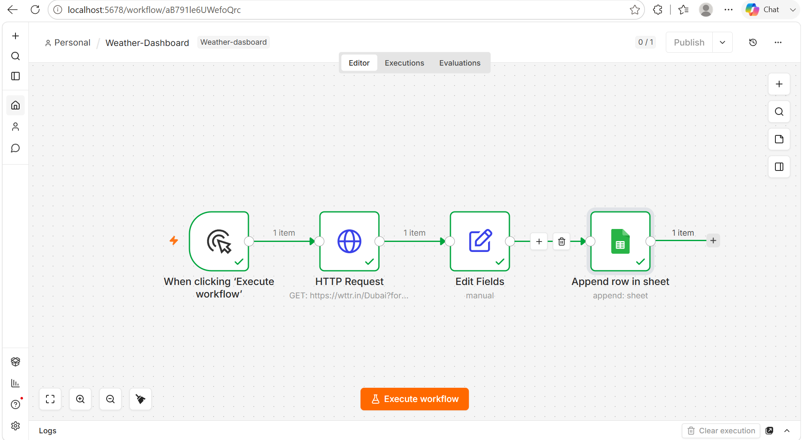
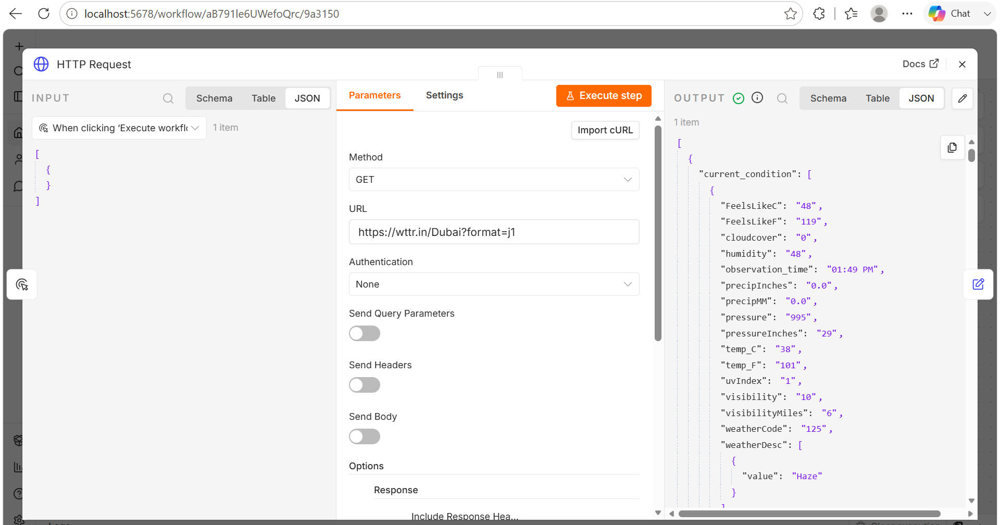
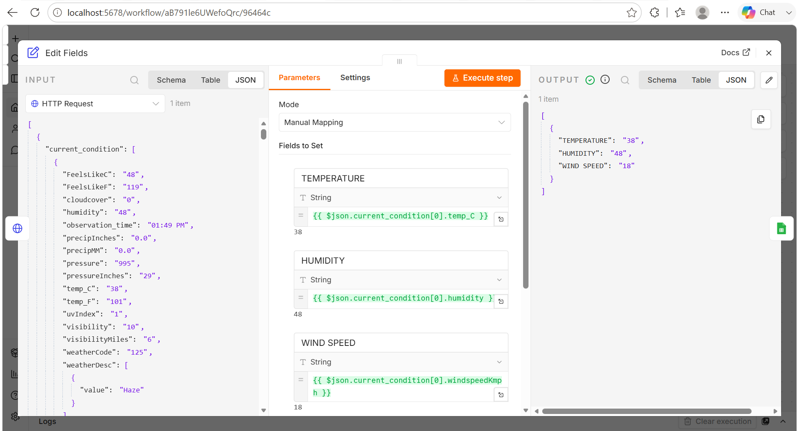
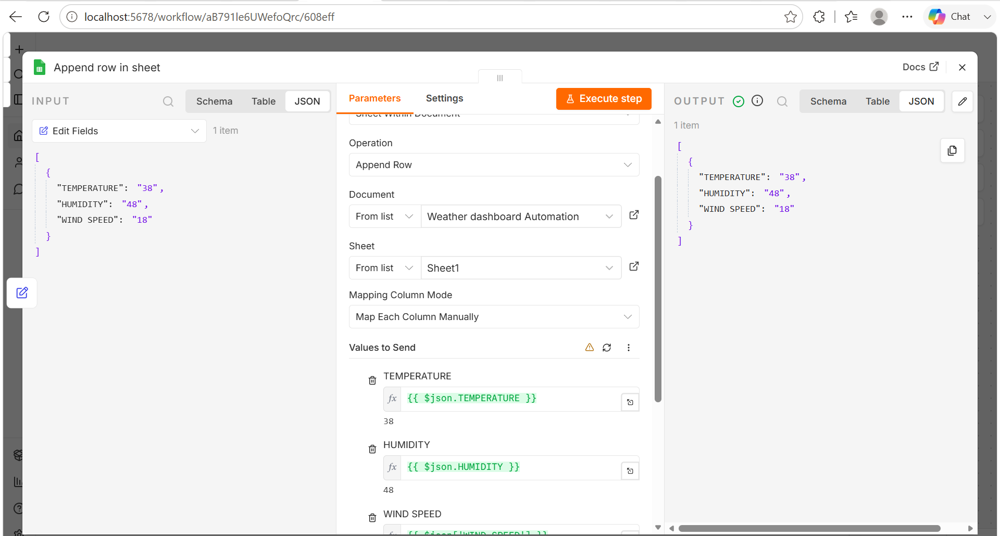
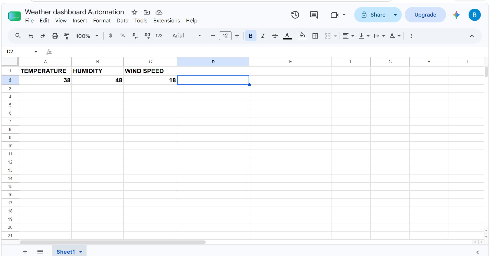

# 🌤️ Weather Dashboard

An automated weather reporting workflow built with n8n that retrieves live weather data, stores it in Google Sheets, and emails a formatted weather report automatically.

---

## Features

- Runs automatically on a schedule
- Retrieves live weather data from a Weather API
- Formats the weather information
- Saves weather records to Google Sheets
- Sends a formatted weather report via Gmail

---

## Technologies

- n8n
- Weather API
- Google Sheets
- Gmail

---

## Workflow

Schedule Trigger

↓

Weather API

↓

Format Weather Report

↓

Append Weather Data to Google Sheets

↓

Send Weather Report

---

## Complete Workflow

---

## Weather API

Retrieves the latest weather information.

---

## Format Weather Report

Formats the API response into a readable weather report.

---

## Append Weather Data to Google Sheets

Stores each weather report for future reference.

---

## Send Weather Report

Automatically emails the weather report to the recipient.

