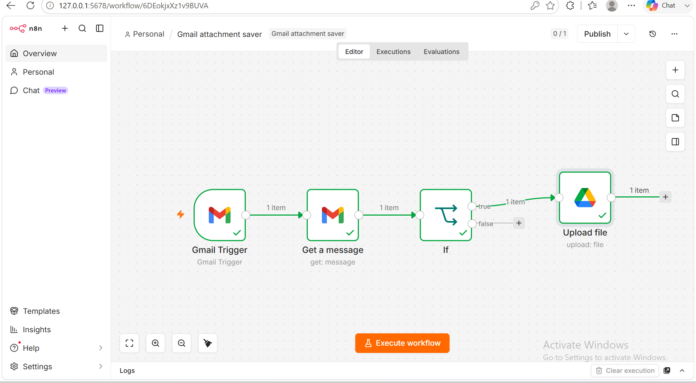
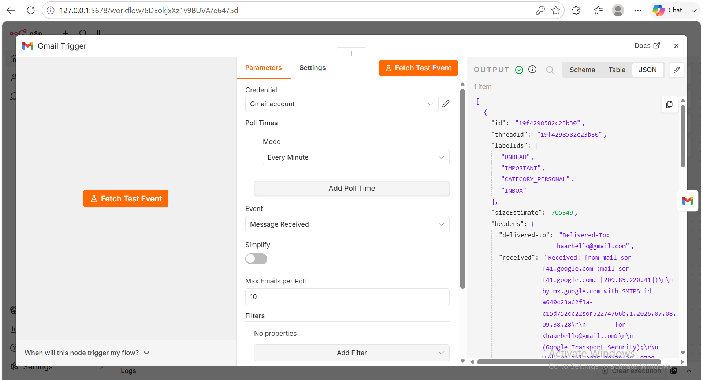
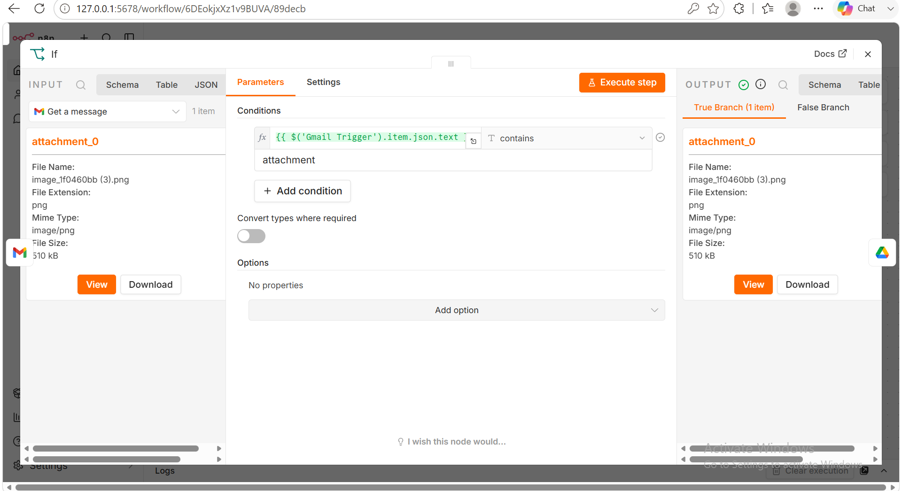
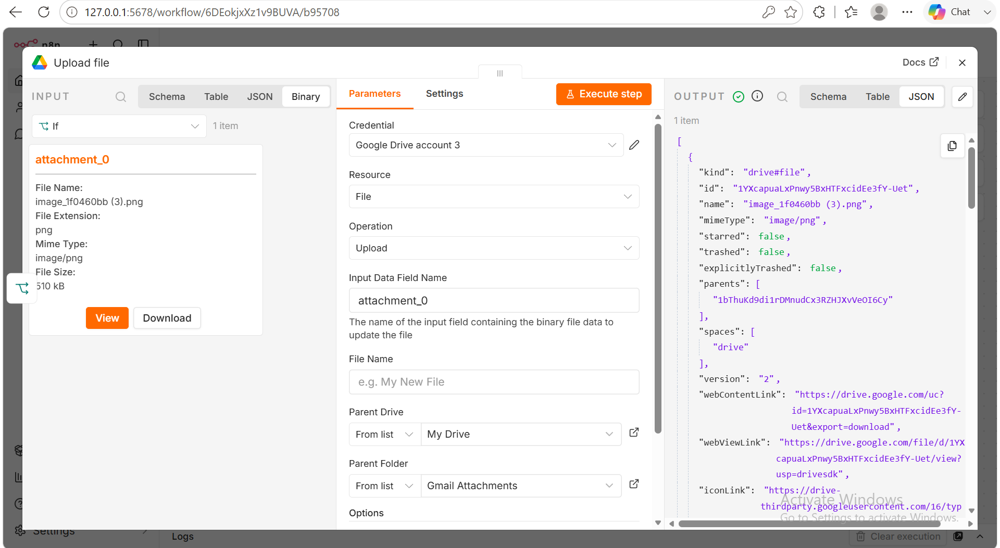
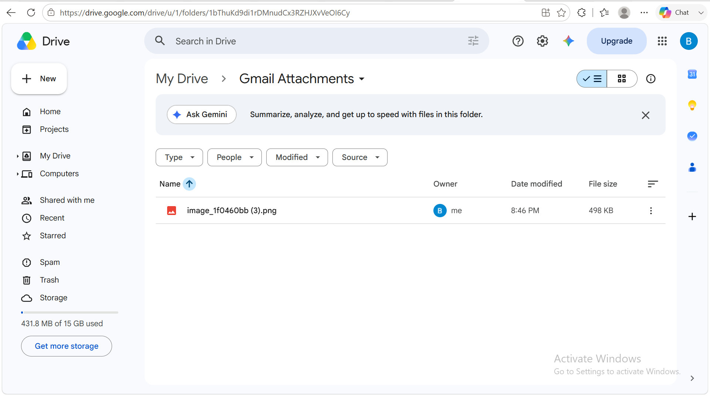

# 📎 Gmail Attachment Saver

Automatically saves Gmail attachments to Google Drive using n8n.

---

## Features

- Monitors Gmail for new emails
- Detects email attachments
- Downloads attachments automatically
- Uploads files to Google Drive
- Organizes documents without manual work

---

## Technologies

- n8n
- Gmail
- Google Drive

---

## Workflow

Gmail Trigger
→ Download Attachment
→ Upload to Google Drive

---

## Workflow Screenshot

---

## Gmail Trigger

Watches Gmail for new emails with attachments.

---

## Download Attachment

Downloads the attachment from the incoming email.

---

## Upload to Google Drive

Uploads the downloaded file into Google Drive.

---

## Google Drive Result

Example showing the uploaded attachment inside Google Drive.

